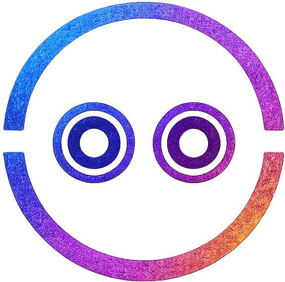

<p align="center">
  
</p>

<h1 align="center">Makoo</h1>
<p align="center">A userscript development framework for Tampermonkey, Violentmonkey, and ScriptCat</p>

<div align="center">
  <a href="https://github.com/makoojs/Makoo/"></a>
  <a href="./LICENSE"></a>
</div>

<div align="center">
  English | <a href="./README.CN.md">中文</a>
</div>

---

Makoo is a userscript development framework for building maintainable Vue / React injection apps for browser script managers such as Tampermonkey, Violentmonkey, and ScriptCat.

It focuses on the parts of userscript development that tend to get messy: waiting for target DOM nodes, mounting components, handling page redraws, managing injection modules, and keeping structural changes hot-updated during development. Build output, userscript metadata, and install flows are still handled by [lisonge/vite-plugin-monkey](https://github.com/lisonge/vite-plugin-monkey); Makoo adds a structured framework layer for component-driven userscript projects.

## When To Use Makoo

Makoo is not meant for simple userscripts. If your script only changes a button, hides an element, or injects a small style block, plain userscript code is often enough.

Makoo is a better fit for userscripts that start behaving like small frontend applications:

- building injected UI with Vue or React to modify existing web pages
- multiple injection points or feature modules on the same page
- host pages that redraw or partially refresh, requiring stable remount behavior
- modules that need to be enabled by URL or page state
- growing codebases that need clear structure, configuration, and development workflow

Makoo becomes useful when lifecycle, module boundaries, and long-term maintenance start to matter.

## Table of Contents

- [When To Use Makoo](#when-to-use-makoo)
- [Quick Start](#quick-start)
- [Core Concepts](#core-concepts)
- [Project Structure](#project-structure)
- [Configuration Overview](#configuration-overview)
- [Manifest Reference](#manifest-reference)
- [HMR Behavior](#hmr-behavior)
- [Recipes](#recipes)
- [Packages](#packages)
- [Special Thanks](#special-thanks)
- [Development](#development)
- [License](#license)

## Quick Start

Create a project with the scaffold:

```bash
pnpm dlx @makoojs/create-makoo
```

Then enter the project and start the dev server:

```bash
pnpm install
pnpm dev
```

A minimal project usually looks like this:

```txt
.
├─ vite.config.ts
└─ injections
   ├─ manifest.ts
   └─ hello-world
      └─ app.vue
```

## Core Concepts

`createMakoo()` creates Makoo's runtime scheduler. It starts declared injection tasks, waits for target nodes, asks the matching adapter to mount components, and handles reinjection when needed.

`Injection Module` is a single injection unit. A module usually maps to a component under `injections/<module-name>/`, and it may also provide its own module-level `manifest.ts`.

`Manifest` is the declarative injection configuration. The top-level `injections/manifest.ts` describes which modules should be injected; module-level files such as `injections/foo/manifest.ts` can contribute fields for the same module, with explicit module fields taking priority.

`Adapter` is the component mounting bridge. Makoo supports Vue and React through `@makoojs/vue` and `@makoojs/react`, and the adapter model can support other mountable artifacts later.

## Project Structure

The recommended structure keeps all injection modules under `injections/`:

```txt
injections
├─ manifest.ts
├─ profile-card
│  ├─ app.vue
│  └─ manifest.ts
└─ react-badge
   ├─ app.tsx
   └─ manifest.ts
```

Use the top-level `manifest.ts` as the project entry configuration. Use module-level `manifest.ts` files when a module should own fields such as `injectAt`, `framework`, `match`, or `hooks`.

Makoo scans these manifests and automatically generates the runtime entry, so a normal project does not need a `main.ts` just to import the manifest or start Makoo.

## Configuration Overview

Makoo's Vite plugin config has four main areas:

```ts
makoo({
	app: {
		name: 'my-script',
		version: '0.0.1'
	},
	source: {
		include: ['*'],
		exclude: []
	},
	monkey: {
		userscript: {
			match: ['https://example.com/*']
		}
	}
});
```

`app` is used to generate userscript metadata such as name, version, and description.

`source` controls where Makoo scans injection modules. Its current `include` and `exclude` fields filter module directories, not page URLs.

Most `monkey` options are passed through to [lisonge/vite-plugin-monkey](https://github.com/lisonge/vite-plugin-monkey) for userscript metadata, dev server behavior, and build behavior. Makoo manages `clientAlias` and `server.mountGmApi` internally, so those options are not user-configurable.

## Manifest Reference

The top-level manifest supports both object and array forms.

`injectionDefaults` defines shared runtime defaults. Modules inherit scalar options such as `alive`, `scope`, and `timeout`; its `hooks` are registered as shared runtime hooks.

`defineInjection` / `defineInjections` and their related types come from `@makoojs/cli/manifest`. Manifests are scanned in Node during a build, while their hooks, callbacks, and activity signals are bundled with the userscript and run in the browser. Keep manifest top-level evaluation free of application side effects and Node-only dependencies, and ensure every file imported by these functions can be bundled for the browser.

Object form is recommended for most projects:

```ts
import { defineInjections } from '@makoojs/cli/manifest';

export default defineInjections({
	injectionDefaults: {
		alive: false,
		scope: 'local'
	},
	injections: {
		header: {
			injectAt: '#header',
			component: './header/app.vue',
			framework: 'Vue'
		},
		badge: {
			injectAt: 'body',
			component: './badge/app.tsx',
			framework: 'React',
			match: {
				include: ['https://example.com/profile/*'],
				exclude: ['https://example.com/profile/settings']
			}
		}
	}
});
```

Array form is useful when entries are generated or need an explicit `name`:

```ts
import { defineInjections } from '@makoojs/cli/manifest';

export default defineInjections({
	injections: [
		{
			name: 'header',
			injectAt: '#header',
			component: './header/app.vue',
			framework: 'Vue'
		}
	]
});
```

Common module fields:

| Field | Description |
| --- | --- |
| `injectAt` | Target selector for injection |
| `component` | Component path relative to `injections/manifest.ts` or the module directory |
| `framework` | `Vue`, `React`, or `auto`; when omitted, Makoo infers it from the component extension |
| `enabled` | Whether the module is enabled, defaults to `true` |
| `alive` | Whether to retry injection after target DOM changes |
| `scope` | Reinjection observation scope, supports `local` and `global` |
| `timeout` | Timeout for waiting for the target node |
| `hooks` | Lifecycle hooks for the current module |
| `match` | URL matching rule for the current module |

`injectAt` must be a CSS selector; `document` and `window` are not supported injection targets.

Module-level URL `match` supports shorthand and object forms:

```ts
match: ['https://example.com/*']
```

```ts
match: {
	include: ['https://example.com/*'],
	exclude: ['https://example.com/admin/*']
}
```

When `match` is omitted, the module is registered on pages where the userscript itself runs. When `match` is provided, Makoo checks `location.href` at runtime before registering that module.

### Standalone Listeners

Top-level `listeners` declares event tasks that are not owned by an injection module. They do
not need a component directory or a framework adapter. In object form, the record key becomes
the listener task ID:

```ts
export default defineInjections({
	listeners: {
		escapeClose: {
			listenAt: 'body',
			type: 'keydown',
			callback: (event) => {
				if (event instanceof KeyboardEvent && event.key === 'Escape') console.log('close');
			},
			match: ['https://example.com/*']
		}
	}
});
```

Makoo generates `listen({ id: 'escapeClose', ... })` for this entry. Listeners also support
`enabled`, `activitySignal`, and the same `match` rules as modules. Use `name` in array form
when a listener needs a stable ID. `listenAt` must be a CSS selector; `document` and `window`
are not supported listener targets.

Standalone listeners belong to the top-level manifest. A module-level manifest describes one injection module; use its `on` field when the event belongs to that component task.

## HMR Behavior

Makoo separates structural changes from regular component updates in dev mode.

| Change | Behavior |
| --- | --- |
| Top-level `injections/manifest.ts` changes | Rescan and update the virtual entry |
| Module-level `injections/foo/manifest.ts` changes | Rescan and update the virtual entry |
| Local hooks, callbacks, activity signals, or files they import change | Recursively track the local dependency and rescan |
| Module-level `manifest.ts` is added or removed | Trigger a structural update |
| Regular component file changes | Let Vite handle native HMR |
| Third-party package dependency changes | Not tracked by Makoo structural scanning |

When splitting hooks into a separate file, prefer static relative imports:

```ts
import { hooks } from './hooks';
```

Makoo continues tracking local files statically imported by hooks and callbacks. Dynamic `import()`, path aliases, and third-party packages are not part of Makoo's structural dependency tracking.

You can write hooks, callbacks, and activity signals directly, use functions already declared in the current file, or import functions from other files. A function can also use variables and other utility functions from the file where it is declared.

## Recipes

### Enable a Module by URL

```ts
import { defineInjections } from '@makoojs/cli/manifest';

export default defineInjections({
	injections: {
		profile: {
			injectAt: '#app',
			component: './profile/app.vue',
			match: {
				include: ['https://example.com/users/*'],
				exclude: ['https://example.com/users/settings']
			}
		}
	}
});
```

### Use a Vue Module

```ts
import { defineInjections } from '@makoojs/cli/manifest';

export default defineInjections({
	injections: {
		panel: {
			injectAt: 'body',
			component: './panel/app.vue',
			framework: 'Vue'
		}
	}
});
```

### Split Hooks

```ts
// injections/hooks.ts
export const hooks = {
	'start:start': () => {
		console.log('[makoo] injector started');
	}
};
```

```ts
// injections/manifest.ts
import { hooks } from './hooks';
import { defineInjections } from '@makoojs/cli/manifest';

export default defineInjections({
	injectionDefaults: {
		hooks
	},
	injections: {
		'hello-world': {
			injectAt: 'body',
			component: './hello-world/app.vue'
		}
	}
});
```

### Reduce Bundle Size with `externalGlobals`

`monkey.build.externalGlobals` and `externalResource` are passed through to [lisonge/vite-plugin-monkey](https://github.com/lisonge/vite-plugin-monkey):

```ts
import { defineConfig } from 'vite';
import { cdn, makoo } from '@makoojs/cli';

export default defineConfig({
	plugins: makoo({
		app: {
			name: 'my-script',
			version: '0.0.1'
		},
		monkey: {
			build: {
				externalGlobals: {
					vue: cdn.jsdelivr('Vue', 'dist/vue.global.prod.js')
				}
			}
		}
	})
});
```

### Use GM APIs

Makoo exposes `@makoojs/cli/monkey` as a stable entry for [lisonge/vite-plugin-monkey](https://github.com/lisonge/vite-plugin-monkey) GM APIs. Prefer capability-level imports so the final userscript only references the GM APIs it actually uses:

```ts
import { gmRequest, gmStorage, gmStyle } from '@makoojs/cli/monkey';

gmStyle.add('.makoo-panel { z-index: 999999; }');

gmStorage.set('token', 'abc');
const token = gmStorage.get<string>('token');

gmRequest.get('https://api.example.com/data', {
	responseType: 'json',
	onload(event) {
		console.log(event.response);
	}
});
```

You can also use the grouped entry. Prefer capability-level imports when you want the smallest generated `@grant` surface; `GMapi` is a convenience entry for shared or exploratory code:

```ts
import { GMapi } from '@makoojs/cli/monkey';

GMapi.storage.set('enabled', true);
```

When `monkey.build.autoGrant` is enabled, which is the default, `@grant` is still generated by [lisonge/vite-plugin-monkey](https://github.com/lisonge/vite-plugin-monkey) from the final code. Development does not require manually mounting global `GM_*` APIs.

## Packages

| Package | Responsibility |
| --- | --- |
| `@makoojs/core` | Framework-agnostic injection runtime |
| `@makoojs/vue` | Vue mount adapter |
| `@makoojs/react` | React mount adapter |
| `@makoojs/cli` | Vite plugin, config resolution, scanning, and code generation |
| `@makoojs/create-makoo` | Project scaffold |

Most userscript projects should start with `@makoojs/cli`. You usually only need to touch `@makoojs/core`, `@makoojs/vue`, or `@makoojs/react` for custom runtime integrations.

## Special Thanks

Makoo is built on top of these excellent open-source projects:

| Project | What it provides |
| --- | --- |
| [Vite](https://vite.dev/) | Modern frontend development and build tooling |
| [lisonge/vite-plugin-monkey](https://github.com/lisonge/vite-plugin-monkey) | Userscript build, metadata generation, and dev workflow |
| [Vue](https://vuejs.org/) | Vue component ecosystem and runtime |
| [React](https://react.dev/) | React component ecosystem and runtime |
| [Vitest](https://vitest.dev/) | Test runner |
| [jiti](https://github.com/unjs/jiti) | TypeScript manifest loading |
| [picomatch](https://github.com/micromatch/picomatch) | Module directory matching |

## Development

```bash
pnpm install
pnpm build
pnpm test
```

Common commands:

| Command | Description |
| --- | --- |
| `pnpm build` | Build all packages |
| `pnpm test` | Run tests |
| `pnpm docs:dev` | Start the documentation site |
| `pnpm docs:build` | Build the documentation site |
| `pnpm lint:fix` | Run Biome checks and fixes |

## License

[MIT](./LICENSE)
